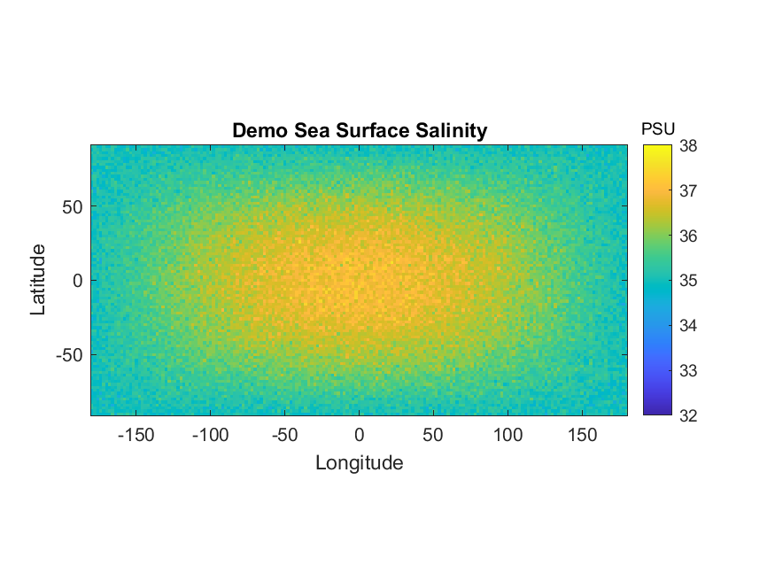

# Observing Climate Change From Space 🌍🛰️

Analysis of Arctic sea ice dynamics using satellite-derived **Sea Surface Temperature (SST)** and **Sea Surface Salinity (SSS)** data.  
This repository demonstrates **data processing, visualisation, and reproducibility** using MATLAB.

---

## 🚩 Problem
Understanding climate dynamics requires monitoring oceans from space.  
Sea surface salinity and temperature are key drivers of:
- Arctic sea ice thickness
- Climate events like **El Niño / La Niña**
- Long-term global warming trends  

---

## 💡 Solution
I built a **MATLAB pipeline** that:
1. Reads satellite-derived data stored in **NetCDF** format  
2. Processes variables such as `sst` and `sss`  
3. Generates reproducible **figures and animations** (heatmaps, scatter plots, time series)  
4. Automatically saves plots into the `/figures` folder so they can be embedded here in the README  

---

## 📊 Results

Example: Demo Sea Surface Salinity (2010–2016)  

*(Add more plots here, e.g. SST heatmaps, scatter plots, time-series trends — just save them to `figures/` and link like above)*  

---

## 🛠️ Tech Stack
- **MATLAB** (data processing, visualisation)
- **NetCDF** (climate data format)
- **Git + GitHub** (version control, documentation)

---

## 🌟 Skills Gained
- Data handling & cleaning for scientific datasets  
- Building reproducible pipelines  
- Visualisation of climate data (heatmaps, time-series, scatter plots)  
- Version control with Git & GitHub  
- Communicating technical results through clear documentation  

---

## 📂 Repository Structure
